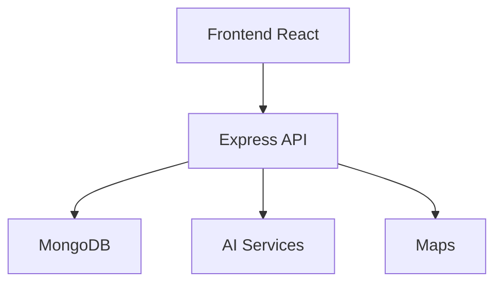

# Olé Sevilla

> ✦ The Cultural AI Experience

---

## ◉ Overview

Olé Sevilla is an immersive digital platform designed to transform how tourists and citizens explore the city of Seville through artificial intelligence, interactive storytelling and futuristic design systems.

The project combines:

- ◌ Artificial Intelligence
- ✦ Gamification
- ◈ Cultural Exploration
- ⟡ Interactive Experiences
- ◇ Emotional Design

to create a next-generation tourism experience.

---

## ✦ Main Technologies

| Technology | Purpose |
|---|---|
| React | Frontend UI |
| Vite | Fast build system |
| Docusaurus | Documentation platform |
| Node.js | Backend services |
| Express | REST API |
| MongoDB | Database |
| TensorFlow.js | AI services |
| Leaflet | Interactive maps |

---

## ⌘ Architecture



---

## ◈ Features

- immersive UI experience
- futuristic design system
- responsive layouts
- AI-ready architecture
- interactive cultural modules
- scalable backend system

---

## ◌ Local Development

```bash
npm install
npm run start
```

---

## ✦ Production Build

```bash
npm run build
```

---

## ⟡ Deployment

The project is designed for deployment using:

- Vercel
- GitHub
- modern CI/CD workflows

---

## ◇ Design Philosophy

> ✦ “Technology should amplify culture, not replace it.”

---