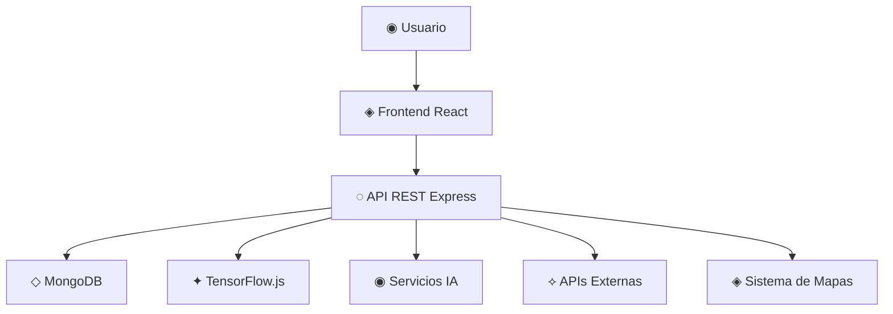
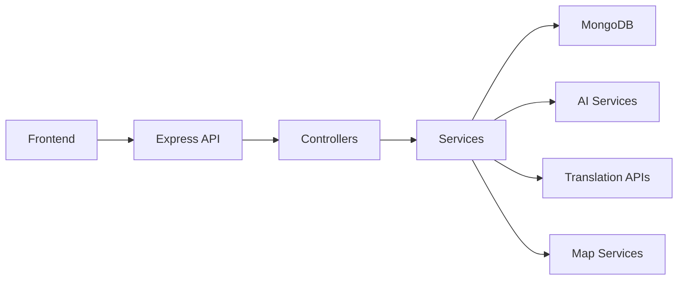
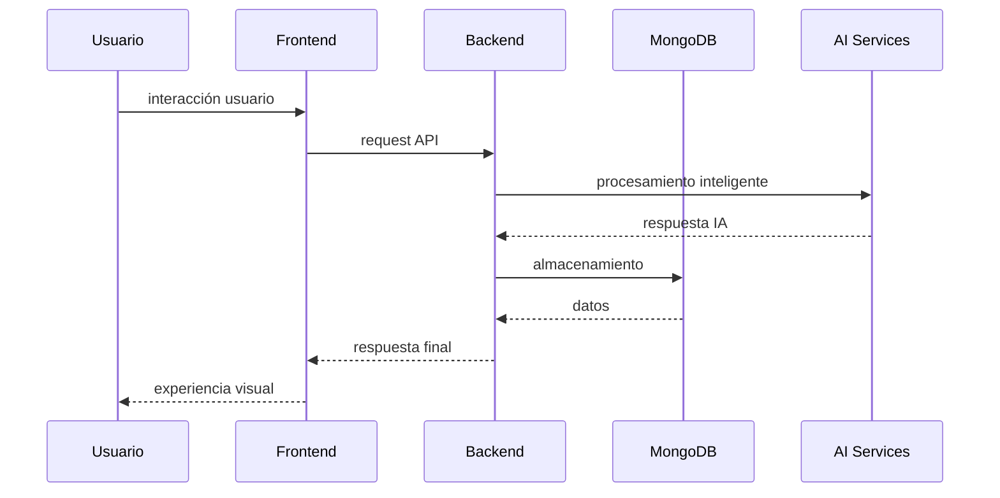

# ◇ System Architecture

> ✦ Modular AI-driven architecture designed for immersive cultural experiences.

---

## ◉ Arquitectura General

Olé Sevilla utiliza una arquitectura moderna basada en una SPA (Single Page Application) conectada a una API REST modular y preparada para servicios inteligentes.

El sistema se divide en:

- ◈ Frontend interactivo
- ◌ Backend desacoplado
- ✦ Servicios IA
- ◇ Base de datos escalable
- ⟡ APIs externas

---

## ⌘ Arquitectura Principal

---

## ◈ Frontend Architecture

El frontend está desarrollado con React y Vite para garantizar una experiencia rápida, modular y responsive.

### ✦ Características

- Renderizado SPA
- Componentes reutilizables
- Navegación dinámica
- Glassmorphism UI
- Responsive Design
- Animaciones modernas

### ◌ Tecnologías

- React
- Vite
- Framer Motion
- Docusaurus
- CSS Modules

---

## ◌ Backend Architecture

El backend funciona mediante una API REST basada en Node.js y Express.

Su función principal es gestionar:

- autenticación
- lógica de negocio
- integración IA
- rutas turísticas
- servicios externos

---

## ✦ Backend Flow

---

## ✦ Servicios de Inteligencia Artificial

Olé Sevilla incorpora múltiples servicios inteligentes diseñados para enriquecer la experiencia cultural.

### ◉ Funcionalidades IA

- reconocimiento visual
- traducción automática
- recomendaciones inteligentes
- text-to-speech
- reconocimiento musical

### ◌ Tecnologías IA

- TensorFlow.js
- APIs de IA externas
- Procesamiento multimedia

---

## ◇ Base de Datos

MongoDB se utiliza como sistema de almacenamiento principal debido a su flexibilidad y capacidad de escalabilidad.

### ✦ Información almacenada

- usuarios
- rutas
- monumentos
- experiencias
- estadísticas
- contenido multimedia

---

## ⟡ APIs y Servicios Externos

| Servicio | Función |
|---|---|
| ◉ Leaflet | Mapas interactivos |
| ◈ OpenStreetMap | Geolocalización |
| ◌ Translation APIs | Traducción automática |
| ✦ Text-to-Speech APIs | Narración inteligente |

---

## ◉ Flujo de Datos

---

## ✦ Escalabilidad

La arquitectura está preparada para:

- múltiples ciudades
- nuevos módulos IA
- microservicios
- integración cloud
- APIs adicionales
- sistemas multilenguaje

---

## ⟡ Arquitectura Futura

En futuras versiones el sistema podría evolucionar hacia:

- arquitectura basada en microservicios
- procesamiento IA en tiempo real
- realidad aumentada
- recomendaciones predictivas
- integración con smart cities

---

## ◇ Filosofía Técnica

> ✦ “La arquitectura no solo debe funcionar.  
> Debe ser capaz de evolucionar.”

---