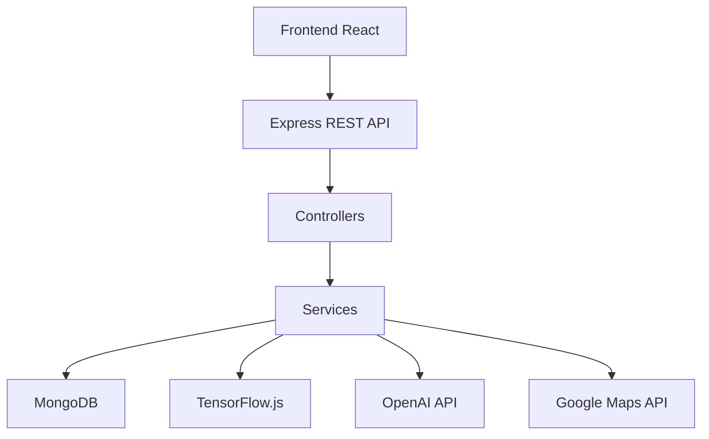
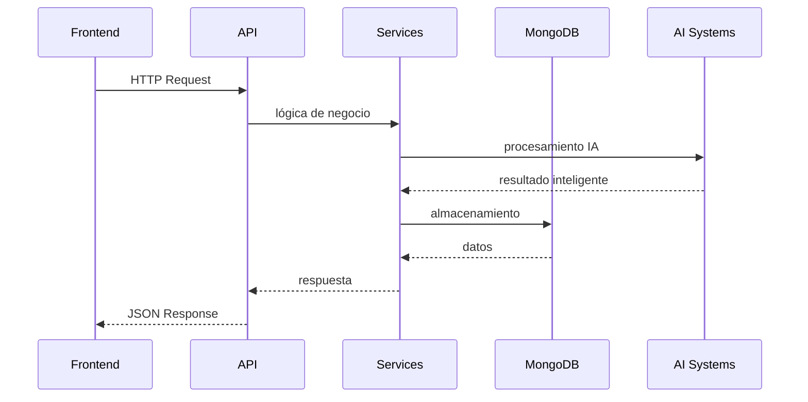

# ◇ Backend System

> ✦ Scalable backend architecture designed for intelligent cultural experiences.

---

## ◉ Visión General

El backend de Olé Sevilla está construido utilizando una arquitectura modular basada en **Node.js** y **Express.js**.

El sistema actúa como núcleo principal encargado de:

- gestión de usuarios
- lógica de negocio
- servicios inteligentes
- integración IA
- procesamiento de datos
- comunicación con APIs externas

---

## ✦ Objetivos del Backend

### ◈ Modularidad

Mantener una arquitectura limpia y escalable basada en módulos independientes.

### ◌ Integración Inteligente

Conectar servicios de inteligencia artificial y procesamiento multimedia.

### ⟡ Rendimiento

Garantizar respuestas rápidas y eficientes.

### ◇ Escalabilidad

Preparar la plataforma para futuros servicios y ciudades inteligentes.

---

## ⌘ Arquitectura Backend



---

## ◈ API REST

La API REST gestiona toda la comunicación entre frontend y backend.

### ✦ Funcionalidades

- autenticación
- gestión de usuarios
- rutas culturales
- servicios IA
- recomendaciones inteligentes
- contenido multimedia

---

### ◉ Endpoints Principales

#### Authentication

```txt
POST /api/auth/register
POST /api/auth/login
POST /api/auth/logout
```

#### Users

```txt
GET /api/users/profile
PUT /api/users/update
```

#### Routes

```txt
GET /api/routes
POST /api/routes/create
```

#### AI Services

```txt
POST /api/scan
POST /api/sound-detection
POST /api/recommendations
```

---

## ✦ API Responses

La API utiliza respuestas estructuradas basadas en JSON.

### ◉ Ejemplos

```json
{
  "success": true,
  "message": "Login successful"
}
```

### ◌ Status Codes

```txt
200 OK
201 Created
401 Unauthorized
404 Not Found
500 Server Error
```

---

## ◌ Estructura del Backend

```txt
backend/

├── controllers/
├── routes/
├── services/
├── middleware/
│
├── middleware/
│   ├── authMiddleware.js
│   └── validationMiddleware.js
│
├── models/
├── utils/
└── server.js
```

---

## ✦ Controllers

Los controllers gestionan:

- requests HTTP
- validaciones
- respuestas API
- comunicación con servicios

---

## ◌ Services

La capa de servicios centraliza:

- lógica de negocio
- procesamiento IA
- consultas externas
- transformación de datos

---

## ◇ Base de Datos

MongoDB permite almacenar información flexible relacionada con:

- usuarios
- experiencias
- monumentos
- rutas
- estadísticas
- contenido multimedia

---

## ✦ Servicios Inteligentes

El backend incorpora múltiples sistemas IA.

### ◉ Capacidades

- reconocimiento visual
- traducción automática
- text-to-speech
- recomendaciones inteligentes
- reconocimiento musical

---

## ⟡ Flujo Backend



---

## ◉ Seguridad

El sistema backend incorpora:

- validación de datos
- sanitización
- control de errores
- middleware de seguridad
- separación modular

---

## 🔐 Authentication System

Olé Sevilla utiliza autenticación basada en JWT (JSON Web Tokens).

### ✦ Características

- login seguro
- persistencia de sesión
- protección de rutas privadas
- middleware de autenticación
- validación de tokens

### ◉ Roles

El sistema está preparado para:

- usuarios estándar
- administradores
- moderadores futuros

---

## ⚙️ Variables de Entorno

El backend utiliza variables de entorno para proteger información sensible.

### ◉ Ejemplo

```env
PORT=3000
MONGO_URI=your_database_url
JWT_SECRET=your_secret_key
OPENAI_API_KEY=your_api_key
GOOGLE_MAPS_API_KEY=your_maps_key
```

### ✦ Objetivo

Permitir:

- seguridad
- configuración cloud
- despliegue flexible
- integración con servicios externos

---

## ✦ Escalabilidad

La arquitectura backend está preparada para:

- microservicios
- cloud deployment
- múltiples ciudades
- servicios IA avanzados
- APIs externas adicionales

---

## ◇ Filosofía Backend

> ✦ “Un backend moderno no solo conecta sistemas.  
> Debe permitir evolucionar experiencias.”

---