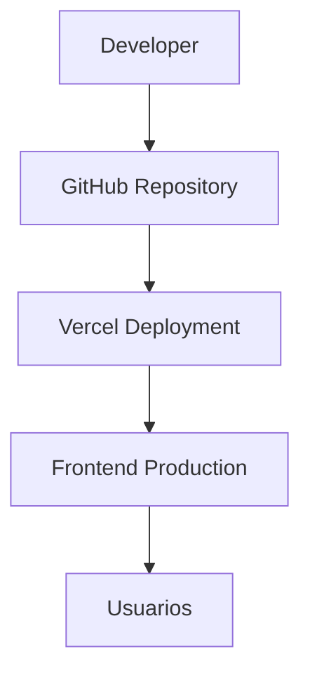

# ◇ Cloud Deployment

> ✦ Modern deployment pipeline designed for scalable digital experiences.

---

## ◉ Visión General

Olé Sevilla está preparado para ser desplegado en plataformas cloud modernas utilizando workflows automatizados y servicios escalables.

La infraestructura permite:

- despliegue rápido
- integración continua
- hosting moderno
- actualizaciones automáticas
- alta disponibilidad

---

## ✦ Objetivos del Despliegue

### ◈ Escalabilidad

Preparar la plataforma para futuros módulos y servicios.

### ◌ Disponibilidad

Garantizar acceso estable y rápido desde cualquier dispositivo.

### ⟡ Automatización

Facilitar actualizaciones mediante integración con GitHub.

### ◇ Simplicidad

Mantener un proceso de deployment limpio y eficiente.

---

## ⌘ Arquitectura Cloud



---

## ◈ Plataforma de Despliegue

### ✦ Vercel

La documentación y frontend se despliegan utilizando Vercel debido a:

- integración con GitHub
- despliegues automáticos
- velocidad de build
- optimización frontend
- hosting global

---

## ◌ Workflow de Deployment

### ◉ Flujo de Trabajo

1. desarrollo local
2. commit Git
3. push a GitHub
4. build automático
5. deployment en Vercel
6. actualización online

---

## ✦ Build Process


---

## ⟡ Comandos Principales

### ◈ Desarrollo Local

```bash
npm run start
```

### ◌ Build Producción

```bash
npm run build
```

### ✦ Preview Local

```bash
npm run serve
```

---

## ◇ Hosting Frontend

La aplicación frontend se distribuye mediante:

- static generation
- optimized assets
- CDN delivery
- caching inteligente

---

## ◌ Integración Continua

El sistema permite futuras integraciones CI/CD mediante:

- GitHub Actions
- pipelines automáticos
- testing automatizado
- builds inteligentes

---

## ✦ Escalabilidad Cloud

La infraestructura puede evolucionar hacia:

- Docker containers
- Kubernetes
- microservicios
- edge deployment
- serverless architecture

---

## 🌍 Production Deployment

La documentación oficial de Olé Sevilla está desplegada en la nube mediante Vercel.

### 🔗 URL Pública

```txt
https://ole-sevilla-docs.vercel.app
```

---

## ✦ Características del Deployment

- despliegue automático
- integración continua
- builds automáticos
- optimización estática
- hosting cloud global

---

## ◉ Continuous Deployment

Cada push realizado sobre la rama principal activa automáticamente:

- build del proyecto
- generación estática
- optimización frontend
- despliegue online

Esto permite mantener una actualización continua y automática de la plataforma.

---

## ⌘ Filosofía DevOps

> ✦ “Desplegar debe ser tan elegante como desarrollar.”

---