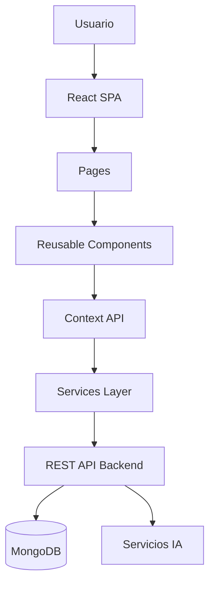
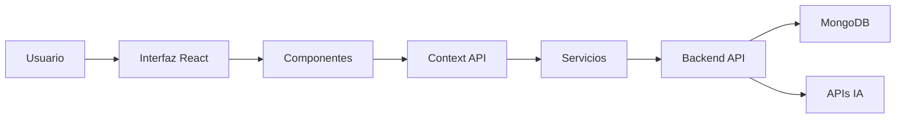

# ◇ Frontend

> Experiencia cultural inmersiva impulsada por inteligencia artificial, diseño emocional y arquitectura futurista.

El frontend de **Olé Sevilla** representa la capa visual e interactiva de la plataforma.  
Su objetivo es transformar la experiencia turística tradicional en una experiencia digital viva, emocional e inteligente.

---

# ✦ Filosofía Frontend

La arquitectura frontend sigue una combinación de:

- diseño modular
- separación de responsabilidades
- mobile-first
- UX inmersiva
- componentes reutilizables
- animaciones cinematográficas

Todo el sistema está diseñado para ofrecer:

- rendimiento
- escalabilidad
- accesibilidad
- interacción emocional

---

# ✦ Stack Tecnológico

| Tecnología | Función |
|---|---|
| React.js | Interfaz SPA |
| Vite | Build ultra rápido |
| Framer Motion | Animaciones |
| React Router | Navegación |
| Context API | Estado global |
| Axios | HTTP Client |
| Leaflet | Mapas |
| TensorFlow.js | IA frontend |
| CSS Modules / Custom CSS | Estilos visuales |

---

# ✦ Arquitectura Frontend



---

# ✦ Estructura del Proyecto

```txt
frontend/
│
├── public/
│   ├── audio/
│   ├── icons/
│   ├── images/
│   └── models/
│
├── src/
│   │
│   ├── assets/
│   │    ├── audio/
│   │    ├── icons/
│   │    ├── illustrations/
│   │    └── videos/
│   │
│   ├── components/
│   │    ├── animations/
│   │    ├── cards/
│   │    ├── forms/
│   │    ├── layout/
│   │    ├── maps/
│   │    ├── modals/
│   │    ├── profile/
│   │    ├── scan/
│   │    ├── social/
│   │    ├── sound/
│   │    └── ui/
│   │
│   ├── context/
│   │
│   ├── data/
│   │
│   ├── hooks/
│   │
│   ├── pages/
│   │    ├── Home/
│   │    ├── ScanOle/
│   │    ├── SoundOle/
│   │    ├── Routes/
│   │    ├── Connect/
│   │    ├── Dictionary/
│   │    └── Profile/
│   │
│   ├── router/
│   │
│   ├── services/
│   │
│   ├── styles/
│   │
│   ├── utils/
│   │
│   ├── App.jsx
│   │
│   └── main.jsx
│
└── package.json
```

---

# ✦ Flujo Frontend



---

# ✦ Componentes Principales

## ◈ 🏠 Home

Pantalla principal inspirada en:

- estética andaluza contemporánea
- iluminación cinematográfica
- diseño inmersivo
- navegación emocional

Incluye:

- hero interactivo
- animaciones
- accesos rápidos
- experiencias visuales

---

## ◈ 🏛️ Scan&Olé

Sistema de reconocimiento visual mediante IA.

Permite:

- detectar monumentos
- identificar lugares
- mostrar información cultural
- activar experiencias interactivas

Tecnologías:

- TensorFlow.js
- reconocimiento de imágenes
- cámara móvil

---

## ◈ 🎵 Sound&Olé

Sistema de reconocimiento musical cultural.

Detecta:

- flamenco
- sonidos urbanos
- música tradicional
- experiencias sonoras locales

Incluye:

- análisis de audio
- identificación cultural
- interacción auditiva

---

## ◈ 🗺️ Rutas Inteligentes

Sistema de exploración gamificada.

Funciones:

- rutas dinámicas
- geolocalización
- checkpoints culturales
- exploración interactiva

Tecnologías:

- Leaflet
- OpenStreetMap
- GPS

---

## ◈ 👥 Olé Connect

Mini red social cultural.

Características:

- publicaciones
- comentarios
- experiencias compartidas
- interacción social

Objetivo:

conectar turistas y habitantes locales.

---

## ◈ 📖 Diccionario Andaluz

Experiencia educativa interactiva.

Permite aprender:

- expresiones sevillanas
- frases locales
- pronunciación
- vocabulario cultural

---

## ◈ 👤 My Olé

Perfil personal del usuario.

Muestra:

- progreso cultural
- insignias
- nivel
- rutas completadas
- estadísticas
- actividad reciente

---

# ✦ Diseño UX/UI

La identidad visual combina:

- glassmorphism
- iluminación neon
- gradientes cálidos
- minimalismo futurista
- cultura andaluza moderna
- diseño emocional

---

# ✦ Sistema Visual

## ◇ Colores

```txt
Negro profundo
Rosa neon
Rojo cálido
Violeta oscuro
Blanco suave
```

---

## ◇ Estilo

- cinematic UI
- immersive gradients
- glowing effects
- smooth animations
- futuristic minimalism

---

# ✦ Navegación

El sistema utiliza:

- React Router
- navegación SPA
- rutas dinámicas
- layouts reutilizables

---

# ✦ Gestión Global del Estado

La aplicación utiliza:

## ◇ Context API

para compartir:

- autenticación
- usuario activo
- preferencias
- progreso
- datos globales

Beneficios:

- evita prop drilling
- arquitectura limpia
- mejor mantenibilidad

---

# ✦ Hooks Personalizados

La carpeta `hooks/` contiene lógica reutilizable como:

- autenticación
- consumo API
- animaciones
- geolocalización
- scroll
- efectos visuales

---

# ✦ Servicios

La carpeta `services/` centraliza:

- llamadas HTTP
- autenticación
- APIs IA
- conexión backend
- procesamiento multimedia

---

# ✦ Rendimiento

El frontend está optimizado mediante:

- lazy loading
- división de código
- optimización de assets
- renderizado eficiente
- componentes desacoplados

---

# ✦ Responsive Design

La interfaz está diseñada para:

- smartphones
- tablets
- desktop
- pantallas ultra wide

siguiendo filosofía:

```txt
mobile-first
```

---

# ✦ Animaciones

La plataforma utiliza:

- Framer Motion
- transiciones suaves
- microinteracciones
- navegación fluida
- efectos cinematográficos

---

# ✦ Integración IA

El frontend puede interactuar con:

- reconocimiento visual
- reconocimiento musical
- traducción automática
- generación cultural inteligente

---

# ✦ Escalabilidad

La arquitectura está preparada para futuras expansiones:

- nuevas ciudades
- realidad aumentada
- experiencias XR
- IA avanzada
- turismo inteligente

---

# ✦ Objetivo Final

Olé Sevilla busca redefinir el turismo cultural mediante una experiencia digital donde:

```txt
tecnología
+
emoción
+
cultura
+
diseño
=
experiencia inmersiva
```

Cada interacción está diseñada para hacer que Sevilla cobre vida frente al usuario.