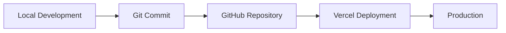

# ◇ GitHub & Version Control

> ✦ Collaborative development powered by modern version control systems.

---

## ◉ Visión General

Olé Sevilla utiliza Git y GitHub como sistema principal de control de versiones y colaboración.

El repositorio permite:

- gestión de cambios
- colaboración organizada
- seguimiento de versiones
- despliegue automatizado
- integración continua

---

## ✦ Objetivos del Sistema de Versionado

### ◈ Organización

Mantener una estructura limpia y controlada del proyecto.

### ◌ Seguridad

Preservar versiones estables y recuperación de cambios.

### ⟡ Escalabilidad

Facilitar futuras colaboraciones y expansión del proyecto.

### ◇ Automatización

Integrar despliegues automáticos mediante workflows modernos.

---

## ⌘ Flujo de Trabajo Git



---

## ◈ Estructura del Repositorio

```txt
ole-sevilla-docs/

├── docs/
├── src/
├── static/
├── docusaurus.config.js
├── sidebars.js
├── package.json
└── README.md
```

---

## ◌ Comandos Principales

### ✦ Inicializar Repositorio

```bash
git init
```

### ◉ Añadir Cambios

```bash
git add .
```

### ◈ Crear Commit

```bash
git commit -m "update project"
```

### ◌ Subir a GitHub

```bash
git push origin main
```

---

## ✦ Convención de Commits

El proyecto sigue una estructura organizada para facilitar el seguimiento de cambios.

### ◉ Ejemplos

```txt
feat: add AI scan system
fix: resolve navbar responsive issue
docs: update backend documentation
style: improve footer design
refactor: optimize services architecture
```

---

## ✦ GitHub como Plataforma

GitHub se utiliza para:

- hosting del código
- colaboración
- control de versiones
- integración con Vercel
- gestión del proyecto

---

## ⟡ Versionado del Proyecto

El desarrollo sigue un sistema incremental basado en:

- mejoras visuales
- nuevas funcionalidades
- optimización frontend
- evolución IA
- mejoras UX

---

## ◇ Integración con Deployment

Cada actualización enviada al repositorio activa automáticamente:

- build del proyecto
- optimización
- despliegue cloud
- actualización online

---

### ◉ Continuous Deployment

El proyecto utiliza integración continua conectada con Vercel.

Cada push realizado sobre la rama principal activa automáticamente:

- build del proyecto
- optimización de assets
- generación estática
- despliegue en producción

Esto permite mantener una actualización continua y automática del entorno cloud.

---

## ◌ Escalabilidad Colaborativa

El sistema está preparado para:

- múltiples desarrolladores
- pull requests
- code reviews
- ramas de desarrollo
- integración continua

---

### ◉ Estrategia de Branches

El proyecto utiliza una estrategia basada en ramas independientes.

#### ◈ main

Contiene la versión estable desplegada en producción.

#### ◌ develop

Utilizada para integración de nuevas funcionalidades.

#### ✦ feature/*

Cada funcionalidad se desarrolla en ramas separadas antes de integrarse en develop o main.

---

## ✦ Filosofía de Desarrollo

> ✦ “Cada commit representa una evolución del producto.”

---