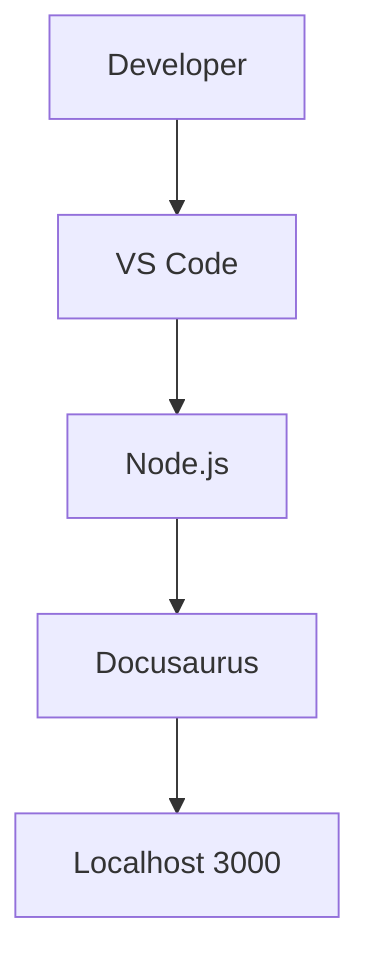

# ◇ Local Development

> ✦ Modern local environment designed for scalable frontend development.

---

## ◉ Visión General

Olé Sevilla puede ejecutarse localmente mediante un entorno moderno basado en Node.js, Vite y Docusaurus.

El sistema permite:

- desarrollo rápido
- hot reload
- testing visual
- documentación interactiva
- experiencia responsive en tiempo real

---

## ✦ Requisitos Previos

Antes de ejecutar el proyecto es necesario instalar:

| Herramienta | Versión Recomendada |
|---|---|
| Node.js | 18+ |
| npm | 10+ |
| Git | Última versión |
| VS Code | Recomendado |

---

### ◉ Base de Datos

El sistema backend está preparado para trabajar con MongoDB como base de datos principal.

Es necesario disponer de una instancia local o cloud de MongoDB para ejecutar funcionalidades avanzadas del sistema.

---

## ⌘ Clonar el Proyecto

### ◈ Git Clone

```bash
git clone https://github.com/your-username/ole-sevilla-docs.git
```

---

## ◌ Acceder al Proyecto

```bash
cd ole-sevilla-docs
```

---

## ✦ Instalar Dependencias

```bash
npm install
```

Este comando instalará todas las librerías necesarias del proyecto.

---

## ⚙️ Variables de Entorno

El proyecto utiliza variables de entorno para proteger claves y configuraciones sensibles.

### ◉ Ejemplo

```env
MONGO_URI=your_database_url
JWT_SECRET=your_secret_key
OPENAI_API_KEY=your_api_key
```

### ✦ Objetivo

Permitir:

- integración IA
- conexión base de datos
- autenticación segura
- despliegue cloud

---

## ◈ Ejecutar Entorno Local

```bash
npm run start
```

La aplicación estará disponible en:

```txt
http://localhost:3000
```

---

## ◌ Build de Producción

Para generar una versión optimizada:

```bash
npm run build
```

---

## ✦ Preview del Build

```bash
npm run serve
```

---

## ⟡ Arquitectura Local



---

## ◇ Estructura Principal

```txt
ole-sevilla-docs/

├── docs/
├── src/
├── static/
├── package.json
├── sidebars.js
└── docusaurus.config.js
```

---

## ◌ Tecnologías Locales

### ✦ Frontend

- React
- Vite
- Docusaurus

### ◈ Diseño

- CSS Modules
- Glassmorphism UI
- Responsive Layouts

### ◌ Desarrollo

- Git
- npm
- VS Code

---

## 🔐 Integraciones Futuras

La arquitectura está preparada para incorporar sistemas de autenticación externa como:

- Google Authentication
- OAuth Providers
- Login social
- Single Sign-On

Estas integraciones permitirán mejorar la experiencia de acceso y personalización del usuario.

---

## ✦ Experiencia de Desarrollo

El entorno local ofrece:

- hot reload
- compilación rápida
- edición en tiempo real
- preview responsive
- modularidad visual

---

## ⌘ Filosofía de Desarrollo

> ✦ “Un entorno moderno acelera la creatividad y la innovación.”

---