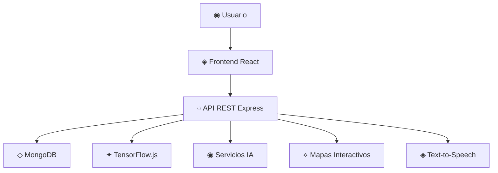

# Olé Sevilla

> ✦ The Cultural AI Experience

---

## ◉ ¿Qué es Olé Sevilla?

Olé Sevilla es una plataforma digital inmersiva diseñada para revolucionar la manera en la que turistas y ciudadanos exploran la ciudad de Sevilla.

El proyecto fusiona:

- ◌ Inteligencia Artificial
- ✦ Gamificación
- ◈ Exploración Cultural
- ⟡ Diseño Emocional
- ◇ Interfaces Futuristas

para construir una experiencia turística inteligente, interactiva y visualmente moderna.

---

## ✦ La Idea

Más que una guía turística tradicional, Olé Sevilla propone una nueva generación de experiencias culturales donde la ciudad cobra vida mediante tecnologías inmersivas y sistemas inteligentes.

Cada monumento, calle o rincón histórico puede:

- ◉ hablar
- ◌ traducir
- ✦ recomendar
- ◈ narrar historias
- ⟡ generar rutas inteligentes
- ◇ crear experiencias personalizadas

---

## ✦ Objetivos del Proyecto

### ◈ Turismo Inteligente

Crear una experiencia moderna donde la tecnología mejore la exploración cultural de Sevilla.

### ◌ Inteligencia Artificial Aplicada

Integrar reconocimiento visual, traducción automática y asistentes inteligentes.

### ⟡ Diseño Futurista

Construir una interfaz inmersiva inspirada en la estética andaluza contemporánea y el diseño UI 2026.

### ◇ Plataforma Escalable

Diseñar una arquitectura preparada para futuras ciudades y servicios culturales inteligentes.

---

## ◇ Ecosistema de Módulos

| Plataforma | Funcionalidad |
|---|---|
| ◉ Scan&Olé | Reconocimiento IA de monumentos |
| ◈ Rutas Interactivas | Exploración cultural gamificada |
| ◌ Sevilla Bee | Asistente turístico inteligente |
| ⟡ Olé Connect | Comunidad social de viajeros |

---

## ⌘ Tecnologías Principales

### ◈ Frontend

- React
- Vite
- Docusaurus
- Framer Motion

### ◌ Backend

- Node.js
- Express
- MongoDB

### ✦ Inteligencia Artificial

- TensorFlow.js
- APIs de traducción
- Text-to-Speech
- Reconocimiento musical

### ◇ Mapas y Geolocalización

- Leaflet
- OpenStreetMap

---

## ⌘ Arquitectura General

---

## ◌ Sevilla Bee

La Sevilla Bee simboliza:

- ◉ exploración
- ✦ curiosidad
- ◈ conexión cultural
- ◌ inteligencia colectiva

Representa la unión entre tradición andaluza y tecnología moderna.

---

## ⟡ Visión del Futuro

Olé Sevilla busca convertirse en una nueva generación de plataformas culturales inteligentes donde cada ciudad pueda ofrecer experiencias inmersivas mediante inteligencia artificial, diseño emocional y tecnologías interactivas.

---

## ◇ Filosofía

> ✦ “La tecnología no reemplaza la cultura.  
> La amplifica.”

---