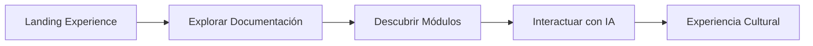
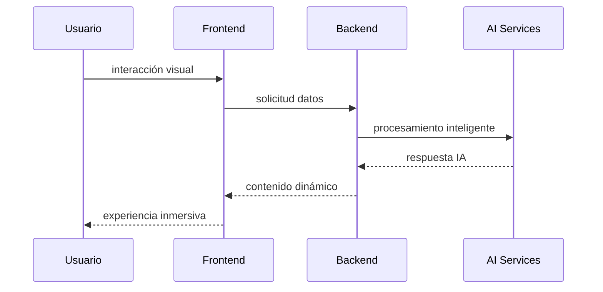

# ◇ User Experience Flow

> ✦ Immersive cultural exploration powered by intelligent interactions.

---

## ◉ Visión General

Olé Sevilla está diseñado para ofrecer una experiencia intuitiva, inmersiva y emocional desde el primer momento.

El flujo de navegación busca combinar:

- exploración cultural
- interacción visual
- inteligencia artificial
- descubrimiento dinámico

---

## ✦ Flujo Principal de Usuario

---

## ◈ Landing Experience

La homepage introduce:

- identidad visual futurista
- branding inmersivo
- navegación principal
- acceso rápido a documentación

### ◌ Elementos Principales

- hero cinematográfico
- glow effects
- glassmorphism UI
- animated cards
- responsive layout

---

## 👤 Registro de Usuario

El sistema está preparado para permitir registro e inicio de sesión mediante autenticación segura.

### ◌ Flujo de Registro

1. Acceder a la plataforma
2. Crear cuenta
3. Introducir email y contraseña
4. Confirmar acceso

---

## 🔐 Inicio de Sesión

Los usuarios autenticados pueden acceder a funcionalidades personalizadas y experiencias inteligentes.

### ✦ Funcionalidades futuras

- progreso cultural
- rutas guardadas
- recomendaciones IA
- experiencia personalizada

---

## ◌ Navegación Principal

El sistema de navegación permite acceder rápidamente a:

| Sección | Función |
|---|---|
| Inicio | Presentación principal |
| Arquitectura | Sistema técnico |
| Frontend | UI y experiencia visual |
| Backend | Infraestructura |
| Tutorial | Flujo de usuario |

---

## ✦ Exploración de Contenido

La experiencia documental está diseñada para facilitar:

- lectura fluida
- navegación rápida
- comprensión visual
- exploración modular

---

## ⟡ Interacción Inteligente

Los sistemas IA permiten futuras funcionalidades como:

- reconocimiento visual
- recomendaciones inteligentes
- asistentes culturales
- rutas dinámicas
- traducción automática

---

## ◇ Experiencia Responsive

El sistema se adapta completamente a:

- desktop
- tablets
- smartphones

### ◌ Características Responsive

- layouts flexibles
- navegación móvil
- typography adaptativa
- componentes escalables

---

## ✦ Experiencia Visual

El diseño visual utiliza:

- iluminación neon suave
- gradients futuristas
- glassmorphism
- motion effects
- cinematic layouts

---

## ⌘ Flujo UX

---

## 🗺️ Flujo de Navegación

El usuario puede:

- explorar documentación
- descubrir rutas culturales
- interactuar con sistemas IA
- acceder a experiencias inmersivas
- navegar entre módulos dinámicos

---

## 📸 Experiencias Inteligentes

La plataforma integra conceptos futuros como:

### ✦ Scan&Olé

Reconocimiento visual de monumentos mediante IA.

### 🎵 Sound&Olé

Detección musical y experiencias sonoras culturales.

### 🧠 Smart Recommendations

Recomendaciones inteligentes basadas en interacción del usuario.

---

## ◌ Filosofía UX

La experiencia busca transmitir:

- descubrimiento
- emoción
- modernidad
- cultura
- inmersión digital

---

## ✦ Filosofía de Experiencia

> ✦ “Explorar una ciudad también puede ser una experiencia inteligente.”

---